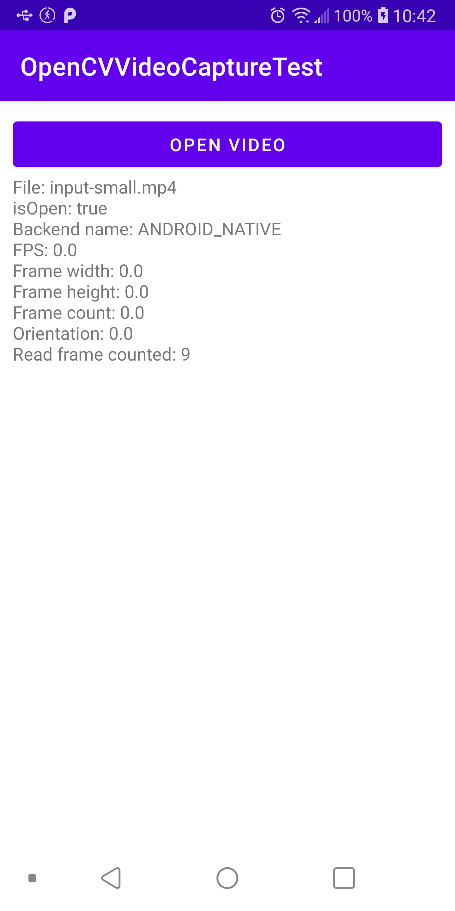
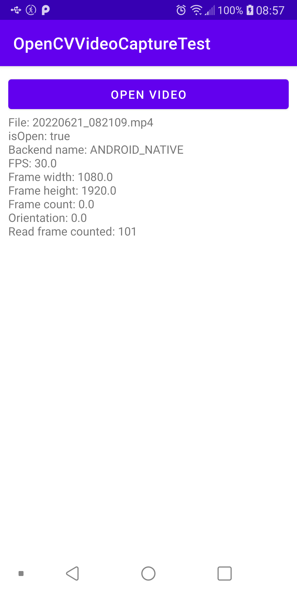

# OpenCV VideoCapture Test

Just a simple application to test VideoCapture for reading a video file and displaying some infomations:
* FPS
* video width & height
* frames count
* real frames count (while reading the video frame by frame)

Special folders:
* sample: contains the video I used for my test
* screenshot: contains the output with the sample video

Results:
Original code (4.6.0) | Modified code (API 21)
--- | ---
 | 